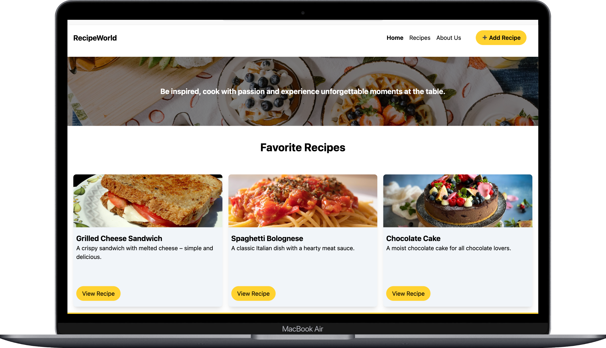

# 🍽️ Recipe World

Recipe World is a simple recipe management app where users can add, edit, view, and delete their favorite recipes. Built with React, Supabase, and Tailwind CSS.

---

## 🖥️ Preview



---

## 🚀 Features

- Add new recipes with ingredients, instructions, category, and image
- Edit and update existing recipes
- Delete recipes
- Categorize recipes using Supabase
- Responsive UI using Tailwind CSS
- Modal-based form for easy recipe management

---

## 🛠️ Tech Stack

<div>
  
  
  
  
  
  
</div>

---

## 📦 Installation

```bash
git clone https://github.com/your-username/recipe-world.git
cd recipe-world
npm install
npm run dev
```

⚠️ Make sure to configure your Supabase credentials in the .env file:

```bash
VITE_SUPABASE_URL=your-url
VITE_SUPABASE_ANON_KEY=your-key
```
